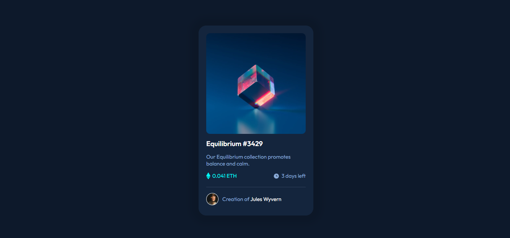

# NFT Card Component

Este é um projeto simples de componente de card NFT feito com **HTML** e **CSS**, baseado em um design moderno e responsivo. O projeto tem como objetivo praticar a criação de interfaces visuais limpas e organizadas utilizando apenas tecnologias básicas da web.

## 💻 Sobre

O card exibe uma arte digital com informações como:

- Nome do NFT: `Equilibrium #3429`
- Descrição: "Nossa coleção Equilibrium promove equilíbrio e calma."
- Preço: `0.041 ETH`
- Tempo restante: `3 dias restantes`
- Criador: `Jules Wyvern`

## 🛠️ Tecnologias Utilizadas

- HTML5
- CSS3

# Guia de Estilo do Front-end

## 🎨 Layout

Os designs foram criados para as seguintes larguras:

- 📱 Mobile: `375px`
- 🖥️ Desktop: `1440px`

## 🌈 Cores

### 🎯 Primárias

- Azul suave: `hsl(215, 51%, 70%)`
- Ciano: `hsl(178, 100%, 50%)`

### ⚪ Neutras

- Azul muito escuro (fundo principal): `hsl(217, 54%, 11%)`
- Azul muito escuro (fundo do card): `hsl(216, 50%, 16%)`
- Azul muito escuro (linha): `hsl(215, 32%, 27%)`
- Branco: `hsl(0, 0%, 100%)`

## ✍️ Tipografia

### 📖 Corpo do Texto

- Tamanho da fonte (parágrafo): `18px`

### 🔤 Fonte

- Família: [Outfit](https://fonts.google.com/specimen/Outfit)
- Pesos: `300`, `400`, `600`

## 🎯 Objetivos

- Reproduzir um design moderno utilizando apenas HTML e CSS.
- Praticar o uso de flexbox, alinhamento de elementos, cores e sombras.
- Treinar responsividade e semântica HTML.

## 🚀 Como visualizar

Para visualizar melhor, basta clicar nesse link: https://chris-valentim.github.io/NFT-Card/

---

Feito com 💙 por [Chris-Valentim]
